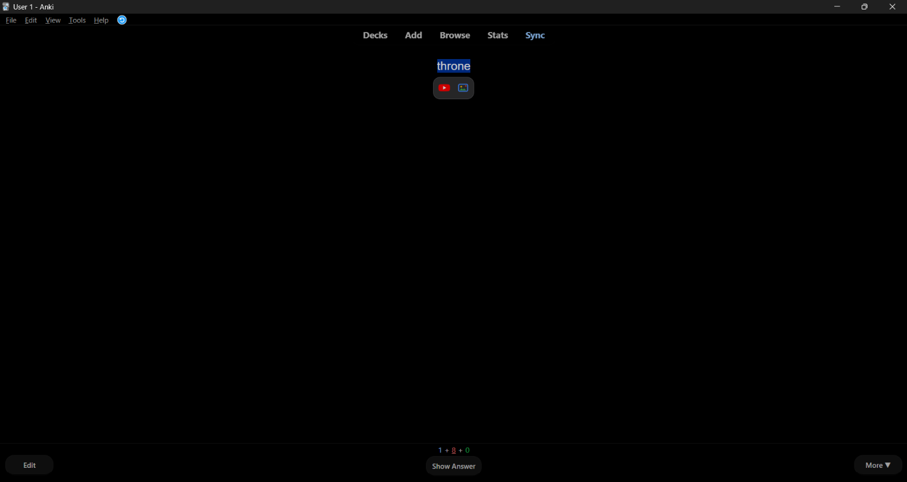

# Context Search for Anki

Click a word on a flashcard and small **YouTube** and **Google Images** icons
appear right next to it. One click opens the search in your browser.



Two ways to use it:

- **Floating icons** - click (or select) a word while reviewing, in the card
  previewer, or in the card layout screen. The icons show up next to the word.
- **Right-click menu** - the same searches, and this one also works in the note
  editor (**Add** and **Browse**) and in the reviewer **More** menu (`m` key).

Both only show up when there is actually a selection, so nothing gets in your
way while you study. Either one can be switched off in the config.

## Install

**From AnkiWeb** (recommended once published)

`Tools > Add-ons > Get Add-ons...` and paste the code `<ANKIWEB-ID>`.

**From a release file**

Download `context_search.ankiaddon` from the
[releases page](https://github.com/Nikhilsinha666/anki-context-search/releases),
then double-click it, or use `Tools > Add-ons > Install from file...`.

**From source**

1. `Tools > Add-ons > View Files` - this opens `.../Anki2/addons21`.
2. Copy the `context_search` folder into it.
3. Restart Anki.

## Usage

**Icons**

1. Click any word on the card - it gets selected and the icons appear above it.
2. Click the YouTube or Google Images icon.

Dragging across a phrase works too. `Esc`, scrolling, or clicking somewhere else
dismisses the icons.

**Right-click**

1. Select a word or phrase.
2. Right-click it.
3. Choose `Context search > YouTube: "..."` or `Context search > Google Images: "..."`.

The search opens in your normal web browser.

The selection is tidied up before searching: `{{c1::word}}` is searched as
`word`, `[sound:...]` tags are dropped, line breaks collapse into spaces, and
surrounding quotes, brackets and commas are trimmed.

## Configuration

`Tools > Add-ons > Context Search (YouTube & Google Images) > Config`

- `popup_enabled` - turn the floating icons off
- `popup_trigger` - `click` shows the icons on a single click, `selection` only
  when you select text yourself
- `popup_icon_size` - icon size in pixels
- rename the submenu, or put the searches straight into the right-click menu
- switch the menu off per screen (reviewer / editor / More menu)
- add your own providers with a URL template:

```json
{ "name": "Wikipedia", "url": "https://en.wikipedia.org/w/index.php?search={query}", "icon": "search", "enabled": true }
```

Icons: `youtube`, `google-images`, `google`, `search`, or `""` for a letter badge.

| Placeholder    | Encoding                              | Example                  |
| -------------- | ------------------------------------- | ------------------------ |
| `{query}`      | query string, spaces become `+`       | `?q={query}`             |
| `{query_path}` | path segment, spaces become `%20`     | `/word/{query_path}/`    |
| `{query_raw}`  | no encoding                           | special cases            |

Google web search, Google definitions, Forvo and YouGlish ship pre-written but
disabled - flip `"enabled": true` to use them. Every option is documented in
[`context_search/config.md`](context_search/config.md), which is also what Anki
shows next to the config editor.

## Development

```
context_search/       the add-on itself
  __init__.py         hooks + search logic
  web/ctxsearch.js    the floating icon bubble (injected into the card webview)
  config.json         default settings
  config.md           config help shown inside Anki
  manifest.json       package id, name, version
tools/check_addon.py  package sanity checks (no Anki needed)
build.ps1             builds dist/context_search.ankiaddon
docs/                 AnkiWeb description + publishing steps
screenshots/          images linked from the AnkiWeb page
```

```powershell
python tools\check_addon.py   # validate the package
.\build.ps1                   # build dist\context_search.ankiaddon
```

How it works: `webview_will_set_content` injects `web/ctxsearch.js` plus a JSON
config into the card webview, and the bubble is built inside a shadow root so
note styling cannot reach it. Clicking an icon sends `ctxsearch:<index>:<text>`
through `pycmd`, which `webview_did_receive_js_message` picks up. The right-click
entries come from `webview_will_show_context_menu`,
`editor_will_show_context_menu` and `reviewer_will_show_context_menu`, reading
the selection with `selectedText()`. Either way the URL is opened with
`aqt.utils.openLink`. Nothing is sent anywhere else.

Publishing steps live in [`docs/publishing.md`](docs/publishing.md).

## License

MIT - see [LICENSE](LICENSE).
